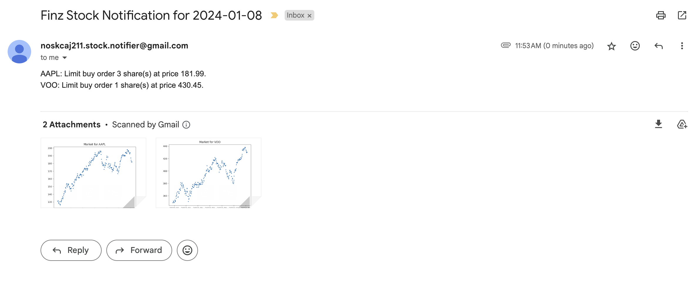
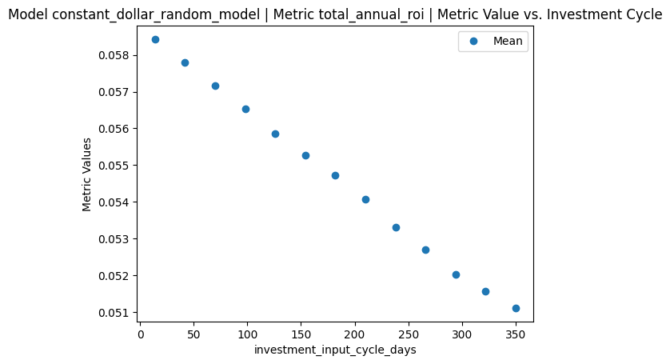
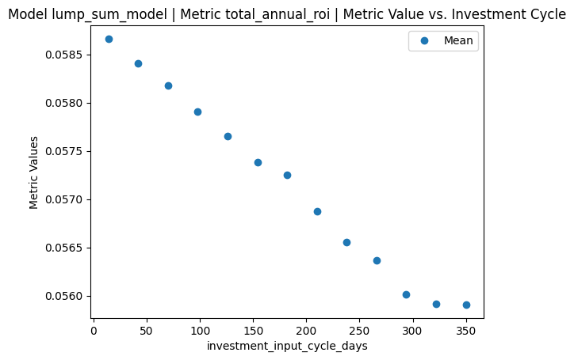

# Support
If you are happy with this, consider supporting through [Venmo](https://venmo.com/u/Jackson-Rusch-1) or [Buy Me a Coffee](https://www.buymeacoffee.com/jacksonrusch) (takes 5% fee).

# Why Should I care?
The most important thing in investing is to have an impartial strategy that you follow. Optimal strategies (even simple ones like always buying an ETF when you have enough money to) requires daily monitoring of the market. This is not something that I wanted to do / think about, so I built this application to do the daily monitoring / decision making for me. If you want to follow a sound & impartial strategy without constantly thinking about the stock market this application is for you!

# Overview
Finz is a stock notification bot that handles buy orders of the stock market for you. You input how much money you have to invest on certain schedules and the percent that you want to put towards each stock, then Finz will tell you when to buy (which optimizes for time in the market). Every weekday at 10:00 EST, Finz will run to determine how much of a given stock to buy. This readme will cover the user experience, the inner logic of Finz, and the validation experiments of the model.

# User Experience
### Sign-Up / Unsubscribe
To sign up / unsubscribe from Finz use [this form](https://docs.google.com/forms/d/e/1FAIpQLSeVDGHrSJfXeQjzP_PXEo7-rQxxDDHf0ll0QKAe7oTX4Azo9Q/viewform). You will get a confirmation email with a spreadsheet to put in your values upon filling out this form.

### Input
Upon filling out a form, you will get an email with a link to a Google Sheet which acts as your input to the this application. You can change these values at any times if your investing strategy changes. There are three sheets that you have access to edit to represent your choices:
#### Stocks Sheet
On this sheet, you can add any number of stock tickers as well as any current balance that you have to invest (which will be lump summed - see the "Model" section for more information) as well as a percentage for how to proportion new money to invest into each ticker. For example, I may have $1000 to invest right now, so I add stocks "VOO" and "SCHD" with $500 each. Then I will add percentage of new income to put towards each stock at 75% and 25%, respectively. 
#### Investment Schedule Sheet
For an optimal investment strategy, you want to invest as much money as possible as often as possible. Usually, people have weekly or biweekly paychecks where there are scheduled deposits into a trading account. The investment schedule sheet allows Finz to keep track of these scheduled deposits to know how much money you have available to invest at any given time. Right now, there are 5 options for investment schedules representing a weekly scheduled deposit for each weekday. For example, if I have a scheduled deposit of $100 each week that is available to trade on Mondays, I would set "Weekly on Mondays" to $100.
#### Orders Sheet
The orders sheet keeps track of orders you should make and whether or not they have been fulfilled. Finz keeps track of your balance by telling you what price to make limit buy orders at and assumes that the order is fulfilled (subtracting the amount from the available balance right away). If Finz believes the order isn't fulfilled after 10 days (which it decides by checking if the "Low" price for the 10 days after the original order notification was made is lower than the limit price), you will be notified and will either have to set the order as fulfilled or make a new limit buy order. You can make any edits to the order sheet if you would like; however, for simplicity it is likely easier if you don't unless instructed.

### Output
At 10:00 EST on weekdays, Finz will boot-up and send you an email telling you to create a limit buy order for the number of stocks at the specified price. Additionally, there will be plots for each stock showing the open price over the previous year.

Note: There are other possibilities for things you can see in your email:
- Order Incomplete Notification | If a limit order may have not completed after 10 days, it is important to make a new limit order. This is determined by checking if the limit order price notified is less than the low price for 10 consecutive days after the original notification (which means if the order was placed on the notification day, then the order may have been completed on the notification day or it was not completed at all). If the order was completed, all you have to do is set the order as completed in the "Orders" sheet. If the order was not completed, you have to delete the order from the sheet and add the order balance back to the stock (then a new order notified in the future).
- Stale Data Warning | If the stock data has not been updated for the given day when the model is run, you will get a stale data warning because the open prices are off by 1 day. This can happen with mutual funds and on holidays when the market is closed. This is included for verbosity so you know that the model is not fully up to date on open prices. If the model tells you to buy shares on a holiday the market isn't open (can't reliably detect in the program), you should still put in the limit buy order to keep the balance up to date.
- Stock Input Errors | You may see various possible errors for reading in values from the user input sheets (Stock, Investment Schedule, or Orders). When an input error occurs, nothing is done for the day (no notification for stock purchases and no input to stock balance). It is important to fix the input error and the program will rerun to get all the actions completed for the day (if the day is skipped the values can be updated later but it will be more effort).
- Internal Error | There are some errors that can occur during the completion of the program. We will look at these to see if anything is inconsistent for your spreadsheets & fix the issue.

# Model
The current model is a lump sum model. This means as many stocks as possible will be purchased at the open price up to the current balance available for the stock. I tried out many other models, some of which performed slightly better than lump sum but without statistical significance. Thus, I decided to keep the lump sum model for simplicity.

I have plans to test out other models that are rooted in statistical patterns of the stock market (for example, using bear/bull indicators, Monday effect, etc.). If any of these models are proven to significantly outperform lump sum, the model will be changed (and anyone that has interest working / testing a model is welcome to use this repo and talk to me).

# Experiments
The evaluation module can run a simulation of a model on stock market data for a specific time frame, with fake buying of stocks and metrics including annual return on investment. The evaluation can both handle buying with fractional shares (representing an expectation of returns) as well as only whole number shares (which is how the model is used).

The validation framework creates a large number of simulations and runs those instances to compute the metrics. The baseline models used are lump sum and dollar cost averaging (DCA).

## Investment Schedule Experiment
This project runs under the assumption that if you have money to invest, you want to invest it earlier rather than later (never wait to invest money). This was analyzed by creating random simulation experiments for many ETFs, market indices, and individual stocks. Then, for each simulation the investment input cycle (when the money is available to the model) varied from 14 to 350 days in increments of 14 days. validation_results/input_cycle_experiment_results.ipynb contains the results for this experiment.

As we can see from the plots, increasing the investment input cycle decreases the annual roi.

## Model Selection Experiment
A validation set of 13750 simulations was used to see which models perform best with many ETFs, market indices, and individual stocks (with randomized parameters for the experiment). There were 4 models tested: DCA, lump sum, lump linear distribution model (takes the percentile of the open price from the previous three days and lump sums only if the percentile is lower than a certain threshold otherwise buys nothing), future limit model (limit order the stock at a certain percent of the open price, if orders are unfulfilled purchase at market value after 10 stock days).

This experiment found that lump sum has a higher annual roi (statistically significant) than DCA more than 75% of the time (consistent with common results).

The lump linear distribution model had a statistically significant higher annual roi than lump sum by 0.0001 points when the simulation has to buy integer stock shares. However, the when it could buy fractional shares, the lump sum performed better with statistical significance.

The future limit model was worse (statisticall significant) than the lump sum model.

From this analysis, I decided that the lump sum model is best to deploy. Though the lump linear distribution model showed potential, it did not perform better enough to beat the status quo power of the lump sum model.

# Problems & Contribution
If you notice anything wrong with this project or have a feature request please open up a Github issue.

If you would like to contribute to this project please reach out to my [email](noskcaj211@gmail.com). There are multiple things that could be improved to make this better that I have on a list :)